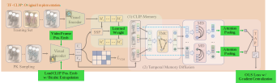

#  X-TFCLIP: An Extended TF-CLIP Method Adapted to Aerial-Ground Person ReIdentification


[](https://arxiv.org/abs/2506.22843)


**X-TFCLIP** is an extended version of the [TF-CLIP](https://github.com/AsuradaYuci/TF-CLIP) framework that leverages temporal and visual-language pretraining (CLIP) for video based aerial-ground person re-identification.



---

## Paper

X-TFCLIP achieved the **1st place** in the [AG-VPReID 2025]((https://agvpreid25.github.io/)): The 2nd Aerial-Ground Person ReID Challenge.

Please consider citing the following article if you found this work helpful. 

```bibtex
@misc{nguyen2025agvpreid2025aerialgroundvideobased,
      title={AG-VPReID 2025: Aerial-Ground Video-based Person Re-identification Challenge Results}, 
      author={Kien Nguyen and Clinton Fookes and Sridha Sridharan and Huy Nguyen and Feng Liu and Xiaoming Liu and Arun Ross and Dana Michalski and Tamás Endrei and Ivan DeAndres-Tame and Ruben Tolosana and Ruben Vera-Rodriguez and Aythami Morales and Julian Fierrez and Javier Ortega-Garcia and Zijing Gong and Yuhao Wang and Xuehu Liu and Pingping Zhang and Md Rashidunnabi and Hugo Proença and Kailash A. Hambarde and Saeid Rezaei},
      year={2025},
      eprint={2506.22843},
      archivePrefix={arXiv},
      primaryClass={cs.CV},
      url={https://arxiv.org/abs/2506.22843}, 
}
```

---

## ✨ Extra features compared to TF-CLIP

- 🔍 **Bicubic CLIP-VIT positional embedding resizing** 
- 🧠 **Lightweight Attention Pooling**
- 🧭 **Online Label Smooth Loss**
- 🎯 **Video Frame Positional Embeddings**
- ⚙️ **Learnable Clip Memory Weighing**
- 💬 **Instance Norm Based BNN-Neck**
- 🔧 **Soft-Biometric Based Distance Matrix Masking** 

Please refer to the original [GitHub repo](https://github.com/agvpreid25/AG-VPReID) for additional code implementations on which this method is based on. 

---

[//]: # (## 🛠 Installation)

[//]: # ()
[//]: # (```bash)

[//]: # (git clone https://github.com/BiDAlab/X-TFCLIP.git)

[//]: # (cd X-TFCLIP)

[//]: # (conda env create -f environment.yaml)

[//]: # (conda activate xtfclip)
